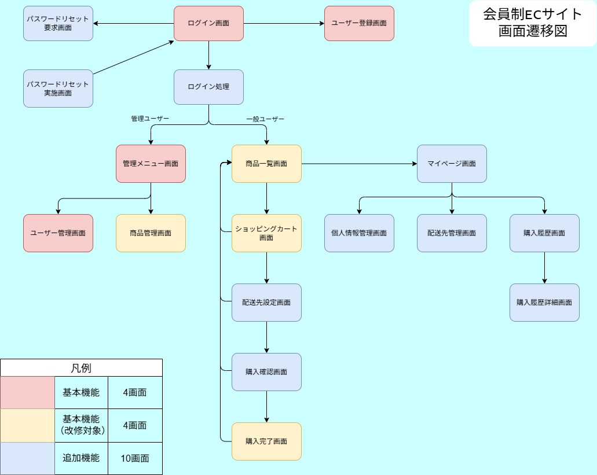

# 概要

## 目的

以前、機能概要の基本機能のみを含む簡易的な会員制ECサイトをPHPの学習としてフレームワークを使用せずに製作しました。

その後、フレームワーク学習の必要性を感じて、Laravel 12を用いて全面的に作り直し、不具合修正や機能追加を行いました。

また、Oracle Cloudにて各種サービスを使用して、インフラストラクチャーから構築することでスキルの幅を広げる取り組みも行いました。

## 開発期間

下記期間で開発作業を行った日は2～4時間程度を製作に充てました。

### 基本機能

2024/08 ～ 2024/10

### 追加機能

2025/02 ～ 2025/04

# 成果物

https://learning.inaho.space/

# 使用技術

## 開発言語

- PHP
- JavaScript
- HTML
- CSS

## フレームワーク

- laravel

## ミドルウェア

- MySQL
- Docker
- Nginx
- Node.js

## インフラストラクチャー

- Oracle Cloud

# 機能概要

## 基本機能

- ユーザー関連機能
	- ユーザー登録機能
	- ユーザー管理機能
	- ユーザーログイン機能
- 商品管理機能
- 商品一覧機能
- ショッピングカート機能

## 追加機能

- パスワードリセット機能
- マイページ関連機能
	- プロフィール編集機能
	- 配送先管理機能
	- 購入履歴表示機能
- 住所自動入力機能

# 機能詳細

## ユーザー関連機能

ユーザー区分は一般ユーザーと管理ユーザーがあり、管理ユーザーはスーパーユーザーと個別ユーザーに別れています。

### ユーザー区分

#### スーパーユーザー
スーパーユーザーは予め登録されており、ユーザーIDとパスワードは環境変数で初期設定します。 

ユーザー管理機能においてユーザーの管理権限の設定を行うことができます。

#### 管理ユーザー

管理ユーザーはユーザー管理機能で登録し、そのユーザーでログインすることができます。

通常の管理作業はこのユーザーで行います。

#### 一般ユーザー

ユーザー登録機能またはユーザー管理機能で登録を行い、登録されたユーザーでログイン後に買物を行うことができます。

### ユーザー登録機能

一般ユーザーが新規利用を開始する際に情報を登録することで、ログインすることができるようになります。

この機能で登録したユーザーはすべて一般ユーザーになります。

### ユーザー管理機能

管理ユーザーがシステムに登録されているユーザー情報を編集することができます。

管理権限の設定や管理ユーザーの新規作成はスーパーユーザーのみが行うことができます。

### ユーザーログイン機能

ログイン画面にてユーザーIDとパスワードを入力することでサイトにログインすることができます。

ログイン完了後は、一般ユーザーは商品一覧画面へ、管理ユーザーは管理メニュー画面へ、自動的に遷移します。

## 商品管理機能

商品の新規登録と既存商品の価格設定・在庫管理・公開可否設定を行うことができます。

この機能はスーパーユーザー以外の管理ユーザーのみ操作することができます。

## 商品一覧機能

公開設定された商品を一覧表示して、選択した商品を指定した個数だけショッピングカートに追加することができます。

## ショッピングカート機能

ショッピングカート内の商品の購入・数量変更・商品の削除の操作を行うことができます。

## パスワードリセット機能

パスワードリセット用リンクを登録されているメールアドレスに送信し、そのリンクからユーザー自身がパスワードをリセットすることができます。

## マイページ機能

ログイン中のユーザーに対応した各種機能をまとめたページになります。

### プロフィール編集機能

パスワード変更を含むプロフィール編集を行うことができます。

### 配送先管理機能

配送先情報を登録・修正・削除を行うことができます。

### 購入履歴表示機能

購入履歴を注文ごとに表示を行うことができます。

## 住所自動入力機能

入力された郵便番号に紐付く住所を自動的に入力することができます。
この機能はAPIとして実装していて、フロント側から呼び出すことで郵便番号に紐付く住所情報を返します。
郵便番号データは日本郵便が[こちら](https://www.post.japanpost.jp/zipcode/dl/utf-zip.html)で公開しているデータをインポートして使用しています。

# 工夫した点

## インフラストラクチャーの構築

Oracle Cloud上のコンピュート・インスタンスにDocker Composeで構築しました。
データベースにはMySQL Database Service、メール送信機能にはEmail Delivery Serviceをそれぞれ利用しています。

## セキュリティ対策

WebサーバーにてLet's Encryptの証明書でTLS対応を行うことでサイトへの接続を保護しています。
Let's Encryptの証明書は有効期間が短いため更新処理の自動化を行っています。
またパスワードのハッシュ化、CSRF対策、XSS対策、SQLインジェクション対策を行いました。
APIとして実装した機能もあるため、APIのセキュリティも考慮しました。

## ユーザー体験向上

ユーザーが操作する際の使い勝手を向上させるための工夫をいくつか導入しました。
選択した時点で画面に画像を表示することで登録前に画像を確認できる画像プレビュー機能を導入しました。
また郵便番号から住所を検索する機能を導入することで、ユーザーが住所を入力する手間を削減しました。

## レスポンシブ対応

画面幅に応じてレイアウトを変更することで、レイアウトが崩れることがないようにしました。

## ダークモード対応

システムに合わせて画面の配色を切り替えるようにしました。

## コンポーネントの活用

共通部分をBladeコンポーネントとして切り出し、部品化して一箇所で変更を行えるようにしました。

## ユーザーテーブルの単一化

ひとつのテーブルで一般ユーザーと管理ユーザーをまとめて管理し、フラグで両者を区別するようにしました。

# 画面遷移図
